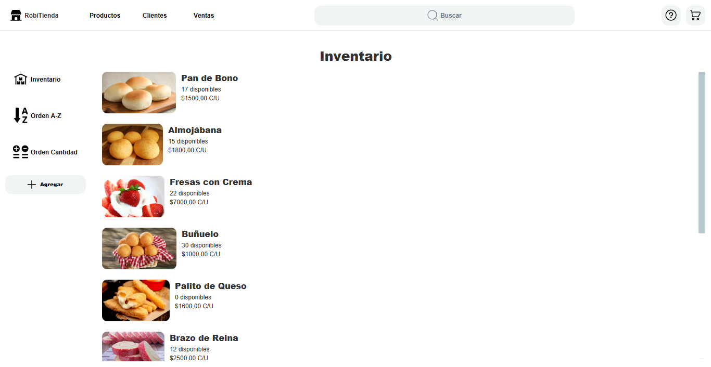
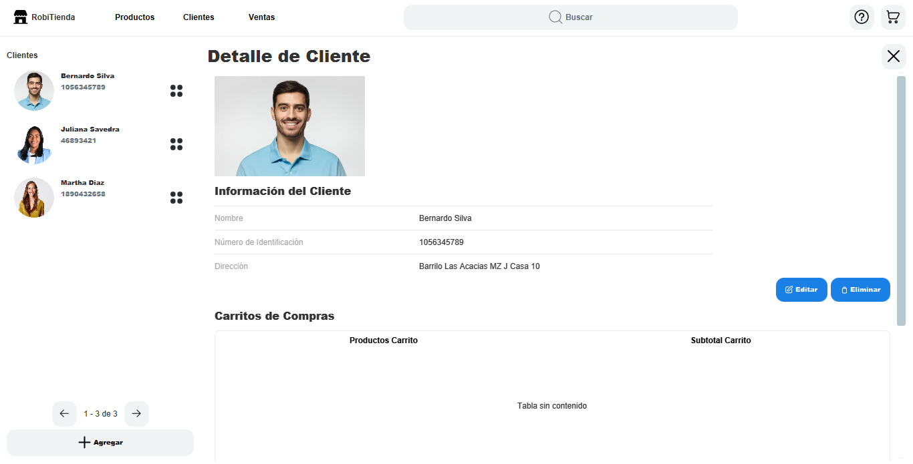
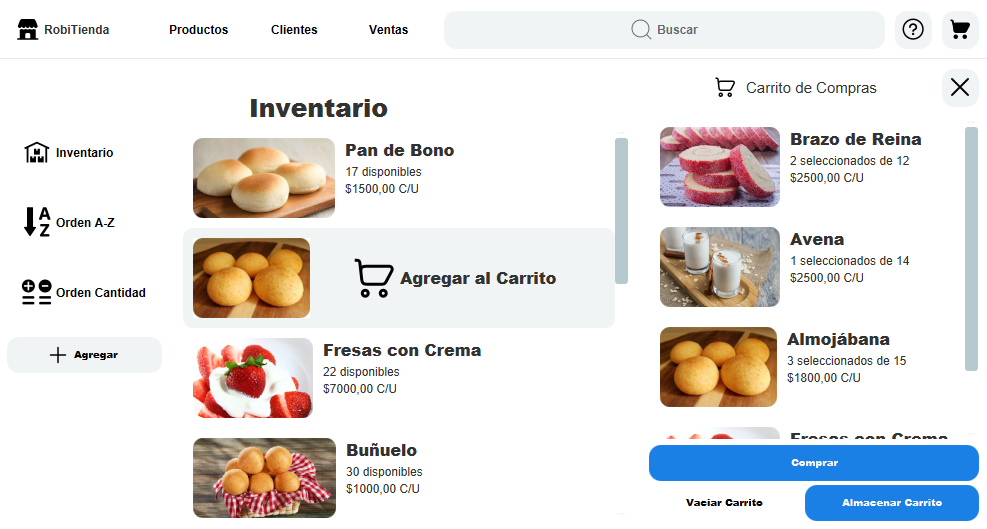
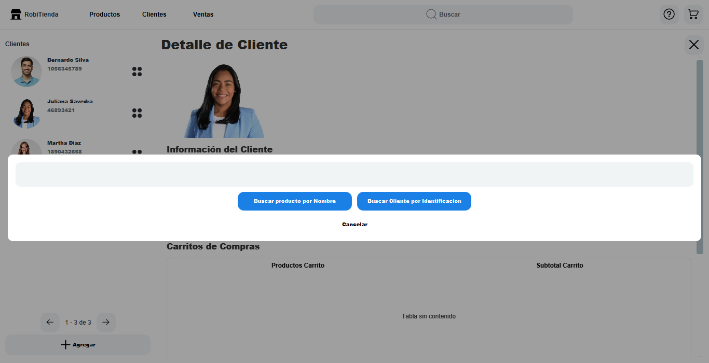

# Laboratorio de Colecciones (Tienda)

Este es el repositorio del laboratorio de Colecciones del espacio académico de _Estructuras de Datos_ del 2024-1, hecho por: [Juan Manuel Amador Roa](https://github.com/Amador02 "Amador02") y [Santiago quintero Uribe](https://github.com/Tourment0412 "Tourment0412")


> [!NOTE]
> Se puede encontrar mas información acerca de los contribuidores acá:<br>
> [](https://github.com/Amador02/laboratorioColecciones/graphs/contributors)

# Información acerca del proyecto

El proyecto consiste en desarrollar un sistema de gestión de inventario para una tienda, para ello se utilizan diferentes colecciones de Java para organizar datos de manera eficiente

### Diagrama de Clases

El diagrama de clases del proyecto se puede ver en la siguiente imagen


### Video Showcase

Para entregar este seguimiento, se hizo un video explicativo tipo __showcase__ que muestra el funcionamiento de la aplicación, el video se puede ver [aquí](https://www.youtube.com/watch?v=ZPb68SpvyqY)

### Snapshots

- Inventario



--------------

- Clientes



--------------

- Carrito



--------------

- Busqueda de Clientes y Productos



> [!IMPORTANT]
> La información del proyecto y sus requisitos se pueden ver en el [PDF ubicado en la carpeta info](info/Laboratorio%20de%20colecciones.pdf "Diagrama de clases").

# Tecnologías Utilizadas
- Java 17
- Javafx 20
- Lombok 1.8.38
- Maven

# Ejecución
Para su ejecución se debe de usar Maven y JavaFX:

```mvn clean javafx:run```
